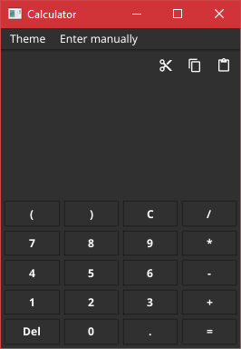

# CALCULATOR

Basic calculator for learning Fyne and honing Go skills.

## Installation

`
git clone https://github.com/fukaraca/calculator-with-Fyne.git
`

After that you can either

`go run main.go` 

or just run 

`calc-go.exe`

